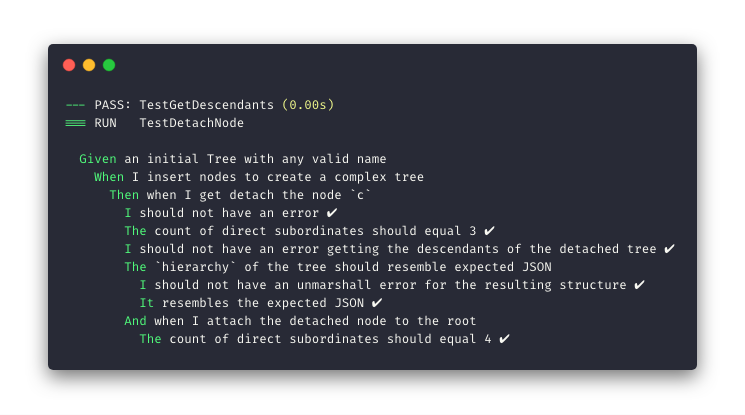

<p align="center">
  
</p>

# Mulungu 
[](https://travis-ci.org/cauli/mulungu) 
[](https://goreportcard.com/report/github.com/cauli/mulungu) [](http://godoc.org/github.com/cauli/mulungu)


Mulungu is a service for creating and managing organizational charts, built in [Go](https://golang.org/).

## Features
- Easy API to manage charts and employees
- Low memory consumption due to the usage of memory pointers
- Fast operations, even with many nodes
- Uses memory cache by default

## Running the server

To run the server:

```
$ docker-compose up
```

When everything is ready, your server will be accessible via `localhost:8080`

## API Overview

| resource                                            	| method      	| description                                                                    	|
|-----------------------------------------------------	|-------------	|--------------------------------------------------------------------------------	|
| `/chart/:chartId`                                   	| GET         	| Retrieves a JSON structure with the whole chart hierarchy                      	|
| `/chart/:chartId`                                   	| PUT         	| Inserts a new chart with id `:chartId`. By default, a `root` node is inserted. 	|
| `/chart/:chartId`                                   	| DELETE      	| Removes `:chartId` completely                                                  	|
| `/chart/:chartId/employee/:employeeId`              	| PUT         	| Inserts an employee to `:chartId`, or updates its info (including leader)      	|
| `/chart/:chartId/employee/:employeeId/subordinates` 	| GET         	| Retrieves a JSON structure containing all subordinates of `:employeeId`        	|

A [Postman documentation](https://documenter.getpostman.com/view/228918/RztoMTZh#intro) and a [Postman collection](https://www.getpostman.com/collections/02ef4141ff6421e376c2) are provided with full examples of requests and responses.

## Tests 
This project uses Behavior Specifications tests, in BDDish style.  

To run the tests:
```
$ docker-compose run mulungu go test -v ./...
```

<p align="center">
  
</p>

## What is the meaning of the name Mulungu?
[*Erythrina Mulungu*](https://en.wikipedia.org/wiki/Erythrina_mulungu) is a native brazilian tree with a distinct red flowers, and an interesting branching pattern. 